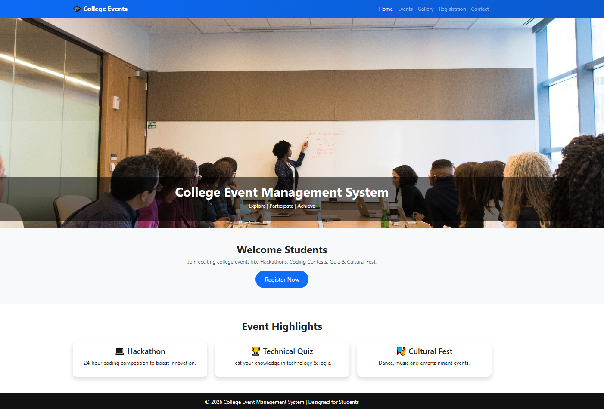
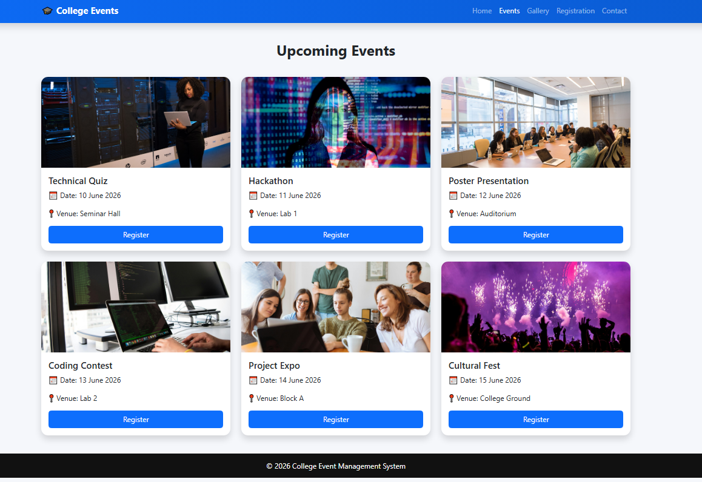
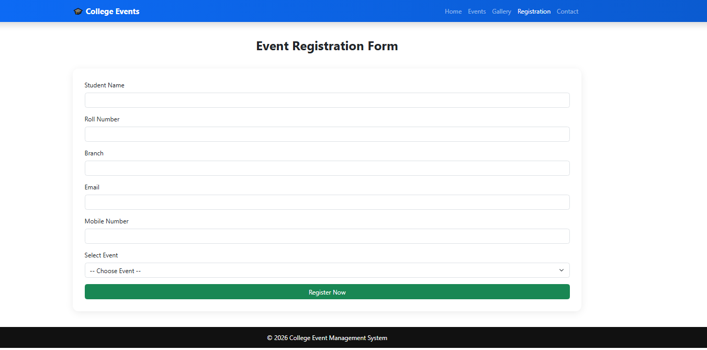
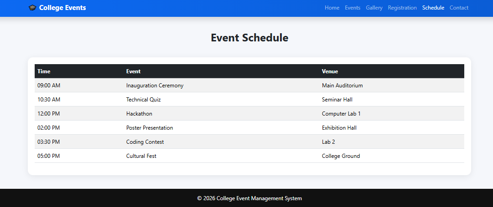
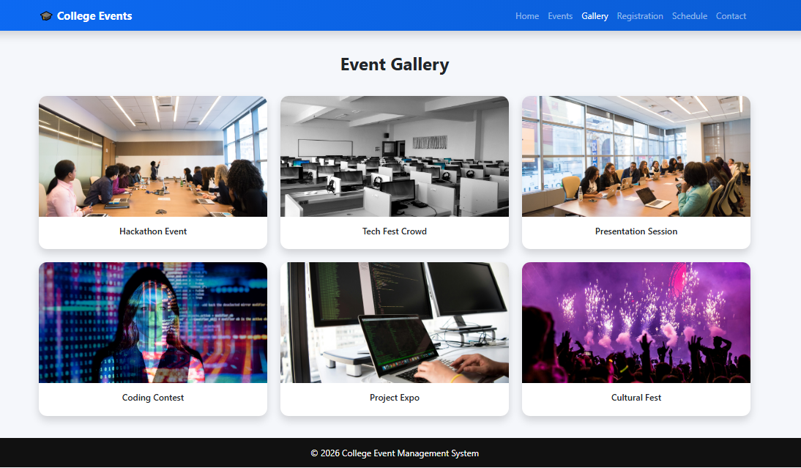
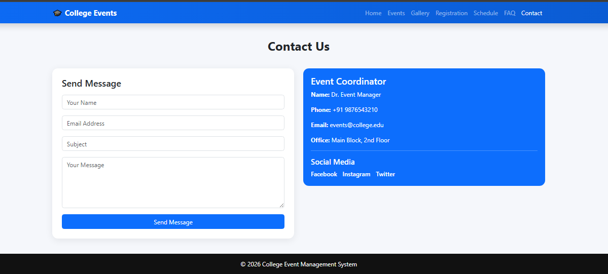

# 🎓 College Event Management System

A responsive **College Event Management System** built using **HTML5, CSS3, and Bootstrap 5**.

This project allows students to **view events, register online, check schedules, view gallery, read FAQs, and contact coordinators** through a modern responsive web interface.

---

## 🚀 Technologies Used

* HTML5
* CSS3
* Bootstrap 5
* JavaScript (Basic UI interactions)

---

## ✨ Features

### 🏠 Home Page

* Responsive Navigation Bar
* Full Screen Carousel Banner
* Event Highlights Section
* Register Now Button (Modal Popup)
* Modern UI Design

---

### 🎯 Events Page

* 6 Event Cards Display
* Event Image, Name, Date, Venue
* Register Button for each event
* Hover Effects on Cards

---

### 📝 Registration Page

* Student Registration Form
* Student Name, Roll Number, Branch
* Email & Mobile Number Fields
* Event Selection Dropdown
* Success Message Alert after submission

---

### 📅 Event Schedule Page

* Responsive Schedule Table
* Time, Event, Venue Columns
* Table-striped & Table-hover
* Clean Layout Design

---

### 🖼️ Gallery Page

* Event Photo Gallery
* Grid Layout System
* Card-based Image Display
* Responsive Images with Hover Effect

---

### ❓ FAQ Page

* Bootstrap Accordion
* Common Student Queries
* Expand/Collapse Questions
* Clean UI Structure

---

### 📞 Contact Page

* Contact Form
* Coordinator Details Section
* Social Media Links
* Success Alert on Message Send

---

# 📸 Project Screenshots

## 🏠 Home Page



---

## 🎯 Events Page



---

## 📝 Registration Page



### Registration Features

* Student Name
* Roll Number
* Branch
* Email
* Mobile Number
* Event Selection
* Success Message Alert

---

## 📅 Event Schedule Page



### Schedule Features

* Time Column
* Event Column
* Venue Column
* Responsive Table Design

---

## 🖼️ Gallery Page



### Gallery Features

* Event Photos
* Grid Layout
* Card Design
* Responsive Images

---

## ❓ FAQ Page


### FAQ Features

* Accordion System
* Expandable Questions
* User-friendly Layout

---

## 📞 Contact Page



### Contact Features

* Contact Form
* Coordinator Information
* Social Media Links
* Alert Message System

---


# 📂 Project Structure

```text
college-event-management/
│
├── index.html
├── events.html
├── registration.html
├── schedule.html
├── gallery.html
├── faq.html
├── contact.html
│
├── style.css
│
├── screenshots/
│   ├── home.png
│   ├── events.png
│   ├── registration.png
│   ├── schedule.png
│   ├── gallery.png
│   ├── faq.png
│   ├── contact.png
│   ├── mobile.png
│
└── README.md
```

---

# 🎨 Bootstrap Components Used

* Navbar
* Carousel
* Cards
* Forms
* Tables
* Accordion
* Alerts
* Buttons
* Grid System
* Modal

---

# 🎯 Learning Outcomes

This project demonstrates:

* Responsive Web Design using Bootstrap 5
* Multi-page Website Structure
* Form Handling UI
* Event Management System Design
* Grid and Flex Layout System
* UI/UX Design Principles

---

# 🔮 Future Enhancements

* Student Login System
* Admin Dashboard
* Database Integration (MySQL / Firebase)
* Real-time Event Registration
* Email Notifications
* Certificate Generator
* Dark Mode UI

---

# 👨‍💻 Author

**Name:** Abubakar Siddiqi Mohammed  

**Program:** B.Tech  

**Branch:** Computer Science and Engineering  

---

## ⭐ Support

If you like this project, don’t forget to ⭐ star the repository on GitHub.

---


